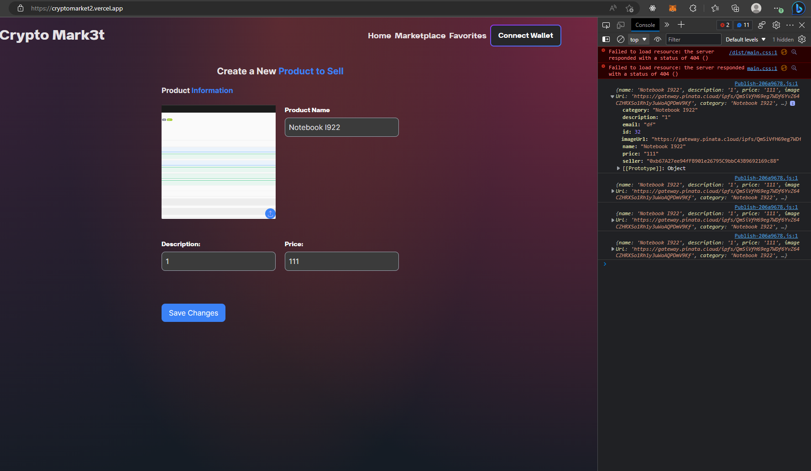

npm install
npm start

http://localhost:3005/api#/

or

mati, amazon me esta empezando a combrar por tener servicios, si te parece testeamos todo con onrender (es una cagada, tarda como 3 minutos en levantar el server y cuando reinicia no guarda la base de datos, pero bueno, de momento nos puede ir sirviendo. saludos)

https://cryotomarket.onrender.com/api

https://cryotomarket.onrender.com/api/products

https://cryotomarket.onrender.com/api/users

https://cryotomarket.onrender.com/api/auth/login

https://cryotomarket.onrender.com/api/auth/register

